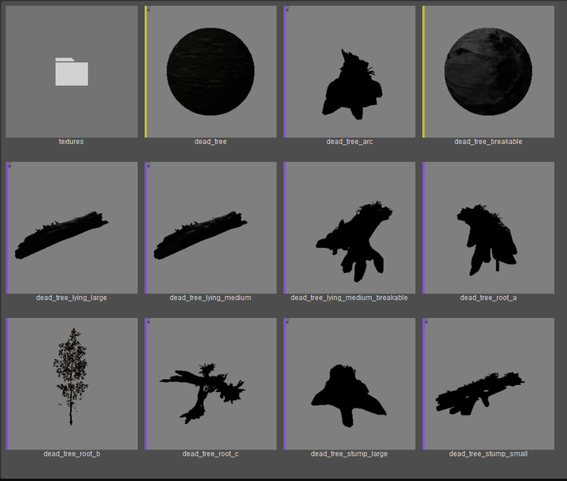
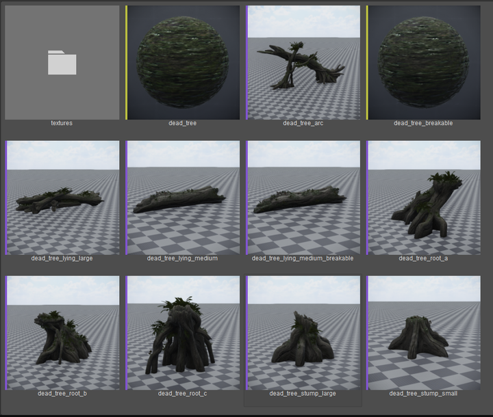
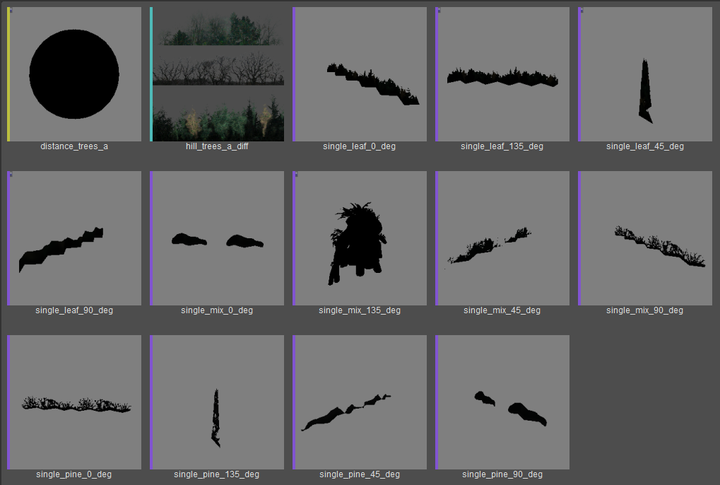
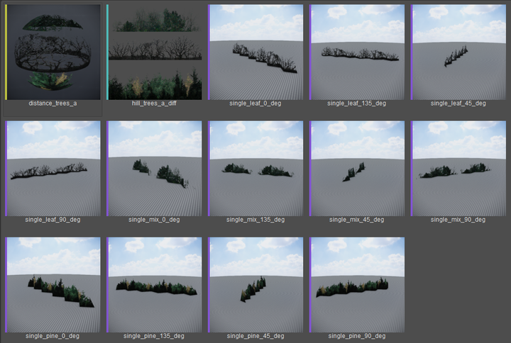
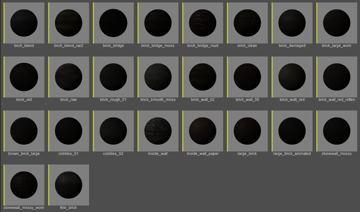
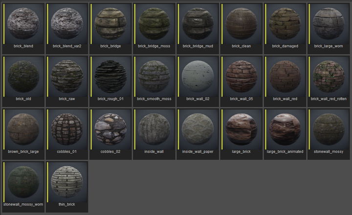
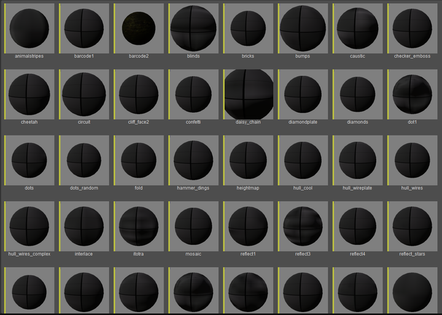
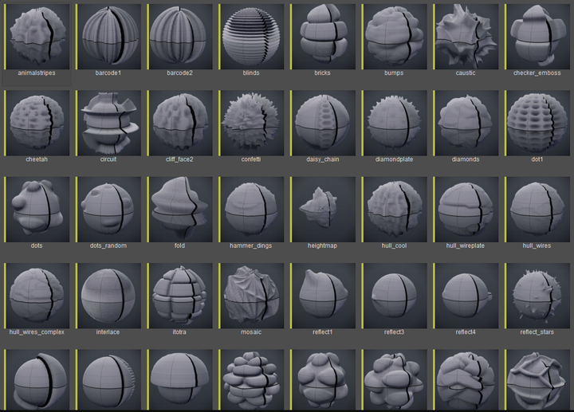

# AssetThumbnailStudio

A CRYENGINE 5.7.1 Sandbox plugin that regenerates Asset Browser thumbnails on a
lit studio stage (ground plate + environment probe + sky dome + low-perspective
camera), fixing the stock generator's off-by-one capture and low-mip blur.
Supports CGF / CGA / SKIN / CHR / CDF / MTL. No engine source modification.

This repo mirrors the CryEngine source tree layout — overlay it directly.

## Building

1. Copy `Code/` onto your engine source root (it only adds
   `Code/Sandbox/Plugins/AssetThumbnailStudio/`).
2. Add one line to the plugin list in `Tools/CMake/BuildSandbox.cmake`:

   ```cmake
   add_subdirectory("Code/Sandbox/Plugins/AssetThumbnailStudio")
   ```

3. Regenerate the solution the official way (`cry_cmake.exe`) and build the
   `AssetThumbnailStudio` target. Output: `bin/win_x64/EditorPlugins/`.

> No CryAgentSDK in your tree? Delete `CryAgentThumbnailExtension.*`, their two
> CMakeLists entries, and the extension usage in `Plugin.cpp` — the editor
> functionality is unaffected.

## Usage

Copy `assets/foxBasic.pak` into your game project's assets directory (or edit
`Code/Sandbox/Plugins/AssetThumbnailStudio/StudioAssets.h` to point at your own
ground plate CGF, sky material, and probe cubemaps).

In the Asset Browser, select one or more assets → right-click →
**Regenerate Thumbnail (Studio)**. Thumbnails refresh automatically after
generation.

## Results

The same Asset Browser selections before and after regeneration with the studio
renderer. All examples below use assets from the CRYENGINE GameSDK.

### Dead-tree assets

| Before | After |
| --- | --- |
|  |  |

### Distance-tree assets

| Before | After |
| --- | --- |
|  |  |

### Brick materials

| Before | After |
| --- | --- |
|  |  |

### Displacement materials

| Before | After |
| --- | --- |
|  |  |
